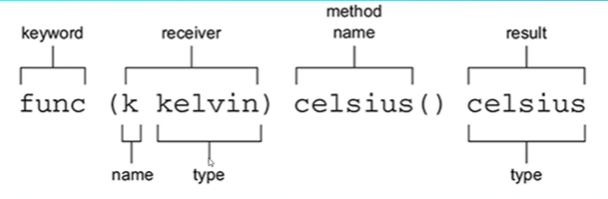

## switch关键字  
 go 不写break，如果有fallthrough则会执行后续case
```go
switch cnt{  
    case 1:
        fmt.Println("1")
        fallthrough
    case 2:
        fmt.Println("2")
 }
```

## 短声明
可以在for循环中使用
```go
var count =0
for count=10;count>0;count--{
}
```
```go
for count:=10;count>0;count--{
}
```
* var不能放在for/if/switch
* **短声明不能够用于包级别变量**

## 浮点类型
* 格式化浮点数
```go
fmt.Printf("%4.2f\n",dec)
```
* 先做乘法再做除法比较有利于精度
* 比较浮点型
```go
math.Abs(dec-0.3)<0.0001
```

## 整型
* 十六进制的表示：
```go
var red=0x00
fmt.Printf("%x",red)
```
* 如何打印比特
```go
fmt.Printf("%b",red)
```
* 时间戳记得要用int64,否则到2038年会溢出

## 大数
* 超过18e18的数可以用：big.Int
```go
distance:=new(big.Int)
distance.SetString("400000000000000000000000",10)//param2代表进制
```
* 分数：big.rat
* 用了big.Int那么公式中其它数也需要是big.Int
* 常量大数可以直接使用于编译阶段（运行期不行），因为存在untype类型常量，原因是**GO编译器使用了big包处理untype Int**

## 字符串
* 如果用`符号，那么转义符无效
* rune类型是Int32类型的别名(UNICODE)
* byte是uint8类型别名（ASC2）
* code point打印值用%v,打印字符用%c
* len()函数忽视了字符可能是8，16，32位的情况，应该用utf8.RuneCountInString()计算长度

## 类型转换
* 浮点转整型是直接发生截断而不是近似
* 数值转化为string:
```go
strconv.Itoa()
str:=fmt.Sprintf()//Sprintf会返回一个字符串
```
* string转化为数值
```go
countdown,err:=strconv.Atoi("10")
if err!=nil{
    //oh no something went wrong
}
fmt.Println(countdown)
```
* go是静态类型语言
* go里面不能将1和0当作true和false

## 函数
* go中大写字母开头函数，变量或其它标识符类似于public，可以被其他包导出，所以调用别的包的函数基本都是大写开头
* 形参 parameter
* 实参 argument
* 可变参数函数
```go
//例如Println
func Println(a ...interface{})(int error)
//...代表参数数量可变
//interface{}代表空接口，可以由任意参数实现
```
* 函数是一等的，可以赋给变量，作为实参
* 匿名函数是可行的：
```go
func() {
    fmt.Println("立即执行")
}()//如果加了括号则立即执行
```
*闭包（closure）就是由于匿名函数封闭并包围作用域中的变量而得名:
```go
func calibrate(offset kelvin) sensor {
    return func() kelvin{
        return s()+offset
    }
}

func main(){
    offset := 5
    sensor :=calibrate(offset)
    //虽然函数返回了，但是sensor仍然能访问offset参数
    //闭包相当于利用形参访问实参，由链式作用域，一层层找到实际调用的参数
}
```

## 类型/方法
* go里面提供了方法但是没有提供类与对象（但是存在类型type）
* 方法可以与同包中任意类型关联
```go
type kelvin float64
type celsius float64
func (k kelvin) celsius() celsius{
    return celsius(k-273.15)
}//k是类型参数的接收者
```
* 方法只能有唯一的接收者


